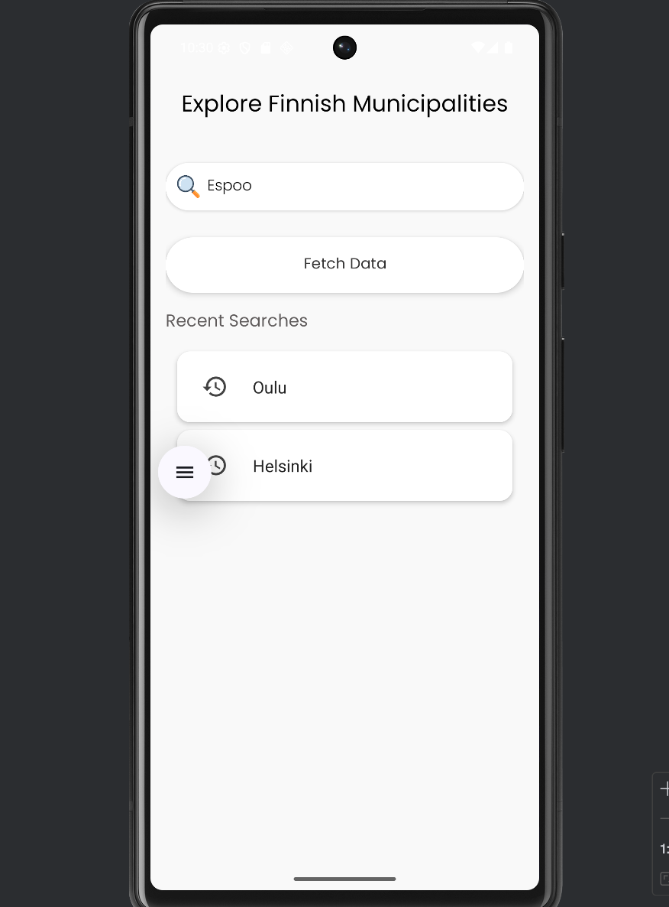
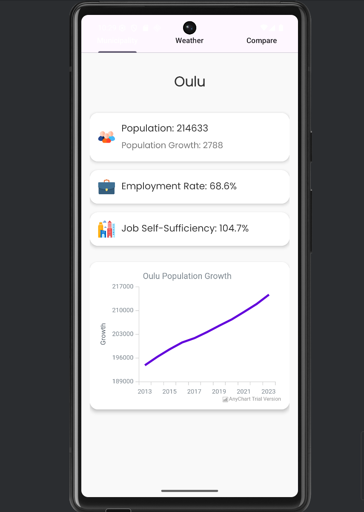
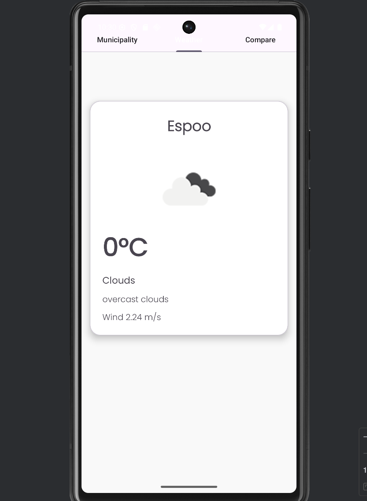
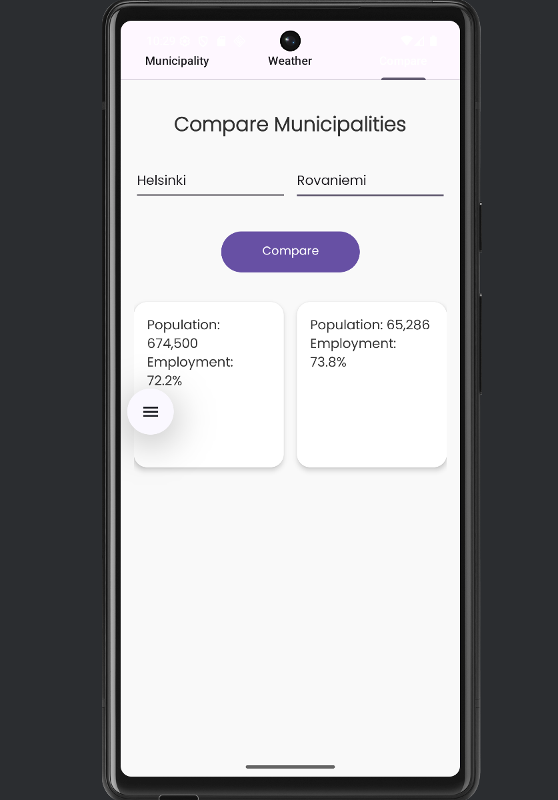

# Municipality App (Android)

An Android application that lets users search for and view information about Finnish municipalities. The app displays statistics and current weather data from selected municipalities. Data is fetched from external APIs, stored locally, and displayed in the UI in real time.

## Features
- **Search Finnish municipalities** 
- **Municipality view**: shows important statistics and visualizes them
- **Weather view**: displays up-to-date weather for the selected municipality
- **Compare view**: compare data between two different municipalities
- **Home view recent searches shortcuts**: recommends and shows quick selections for recently searched municipalities

## Data Sources
- **Statistics Finland (Tilastokeskus)** – municipality statistics
- **OpenWeather** – current weather data

## Architecture
- **Fragment-based UI** 
- Data is **retrieved from APIs**, **saved locally** and **updated dynamically** in the interface


### Requirements
- Android Studio
- Android SDK
- Internet connection (for API requests)

### Run the Project
1. Clone the repository:
   ```bash
   git clone <your-repo-url>
   ```
## UI Screenshots

<p>
  
  
</p>
<p>
  
  
</p>

   

